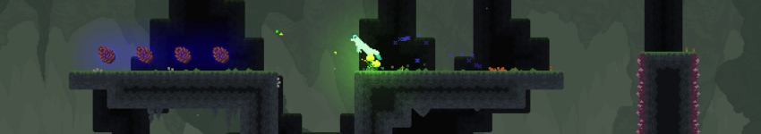
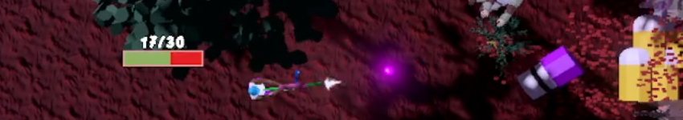
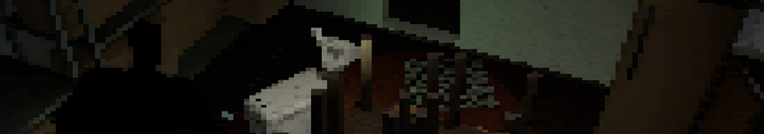
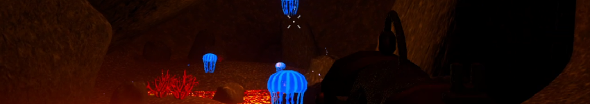

# Aleksi Lummila -🏳️‍🌈 Game Development 🏳️‍🌈
Video games are an art form and I chose to use that medium to express myself. I currently study IT engineering, majoring in game production. My main strengths are artistic integrity, accessibility first -approach and solid fundamental understanding of programming principles. I am an unyieldingly inclusive, pro-queer feminist.
### **NO PROJECT OF MINE USE GENERATIVE AI AT ANY POINT OF THEIR DEVELOPMENT, AND I WEAR THAT STATEMENT AS A BADGE OF HONOR.**

### [My itch.io page!](https://heyitsyoker.itch.io/) 🎮
### [Studio Kette Steam page! (Director of Board)](https://store.steampowered.com/developer/studiokette) 🦊
## Finished projects:

### [Prophecy of Vul](https://store.steampowered.com/app/4346000/Prophecy_of_Vul/) | A story-focused platforming adventure made in Godot 4.5.
Created by Studio Kette, an employee-owned company of four people.
**Roles:**
- Director
- Producer
- Lead Programmer
- UI Designer
- Marketeer

**Learning focus:**
- Directing and producing an independent game production
- Composition and scalable code in Godot
- Finishing a started commercial product
- LiveOps
- Marketing a new IP
##

### [GirlyPOPPED!](https://heyitsyoker.itch.io/girlypopped) | A casual feminist top-down shoot-men-up made in Unity 6.
Solo project! <3

**Learning focus:**
- Using Unity Engine 6 (and Unity Analytics)
- Scope handling
- Commitment to finishing a solo project
##

### [Put To Sweep](https://heyitsyoker.itch.io/put-to-sweep) | A retro horror game made in UE5, where you control a robot vacuum to free imprisoned animals.
**Roles:**
- Character and systems programming
- Enviromental Design
- Sound editing

**Learning focus:**
- Unreal Engine 5 scripting
- Environmental design
- Working as a part of a game developer team
##

### [Aquakill](https://dancingsoldier.itch.io/aquakill) | An underwater first person shooter made in Unity 6.
**Roles:**
- Enemy AI
- Serialization

**Learning focus:**
- Using Unity Engine 6
- Enemy pathfinding
- Safe serialization principles
##
<!--
**lummila/lummila** is a ✨ _special_ ✨ repository because its `README.md` (this file) appears on your GitHub profile.

Here are some ideas to get you started:

- 🔭 I’m currently working on ...
- 🌱 I’m currently learning ...
- 👯 I’m looking to collaborate on ...
- 🤔 I’m looking for help with ...
- 💬 Ask me about ...
- 📫 How to reach me: ...
- 😄 Pronouns: ...
- ⚡ Fun fact: ...
-->
